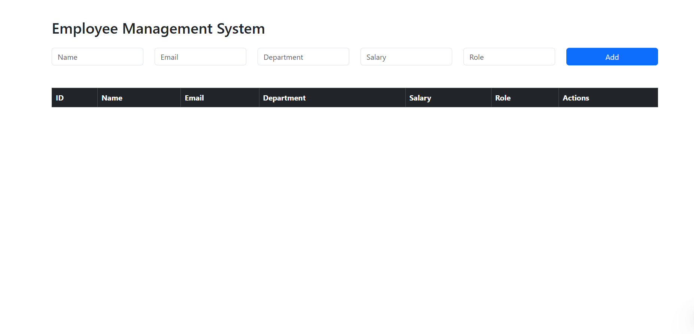
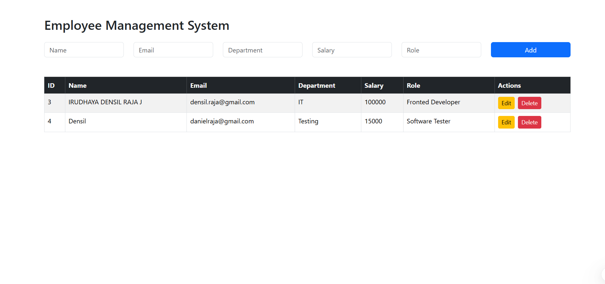

# Employee Management System Full Stack

A full-stack Employee Management System developed using ReactJS, Spring Boot, and MySQL.

---

## Features

- Add Employee
- View Employees
- Update Employee
- Delete Employee
- REST API Integration
- MySQL Database Connectivity

---

## Tech Stack

### Frontend
- ReactJS
- Axios
- Bootstrap
- Vite

### Backend
- Spring Boot
- Spring Data JPA
- REST APIs
- Maven

### Database
- MySQL

---

## Project Architecture

```text
React Frontend
      ↓
Axios HTTP Requests
      ↓
Spring Boot REST APIs
      ↓
Service Layer
      ↓
Repository Layer
      ↓
MySQL Database
```

---

## Screenshots

### Employee Dashboard



---

### Add Employee


---

### Update Employee


---

### Delete Employee



---

## API Endpoints

| Method | Endpoint | Description |
|---|---|---|
| GET | /api/employees | Get all employees |
| GET | /api/employees/{id} | Get employee by ID |
| POST | /api/employees | Add employee |
| PUT | /api/employees/{id} | Update employee |
| DELETE | /api/employees/{id} | Delete employee |

---

## Backend Setup

```bash
cd backend
mvn spring-boot:run
```

---

## Frontend Setup

```bash
cd frontend
npm install
npm run dev
```

---

## Database Configuration

Update application.properties:

```properties
spring.datasource.url=jdbc:mysql://localhost:3306/employee_db
spring.datasource.username=root
spring.datasource.password=yourpassword
```

---

## Author

Irudhaya Densil Raja J